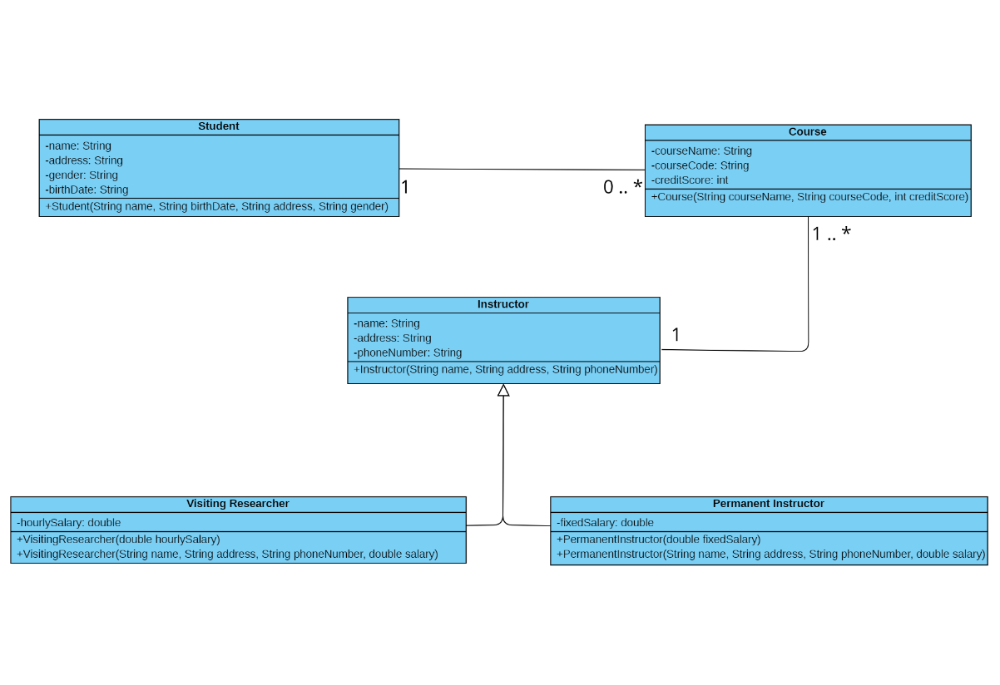

# Java_Bootcamp_HW1

This is a Spring Boot application implements School Management System. 

I will do this project homework again in the coming days.

Features:

• A Student could take zero or more courses.

• Instructors could instruct at least one or more courses. 

• A course could be instructed by only one instructor.

The program does not implement cardinality in the code, but you can show the cardinality on the uml diagram.

The design is based on the MVC model.

Thanks.
